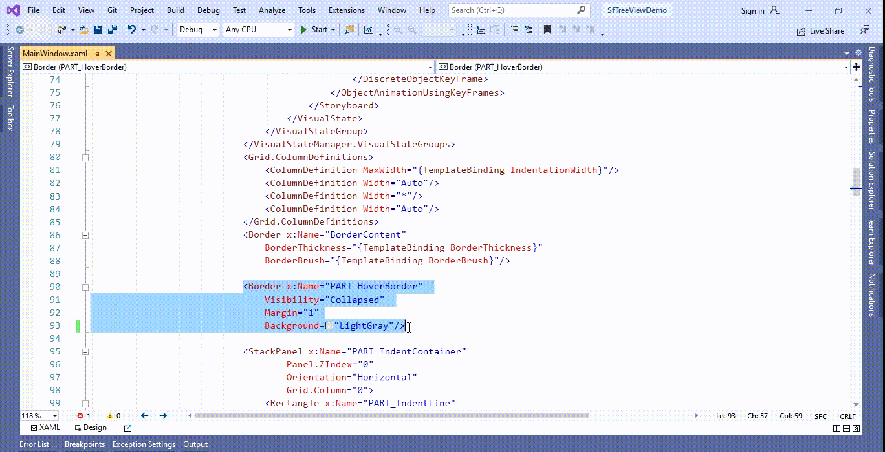

# How to disable MouseOver highlight when hovering over items in WPF TreeView (SfTreeView)?

## About the sample
This example illustrates how to disable MouseOver highlight when hovering over items in WPF TreeView (SfTreeView)

By default, [SfTreeView](https://help.syncfusion.com/cr/wpf/Syncfusion.UI.Xaml.TreeView.SfTreeView.html) does not provide the direct support to disable the MouseOver highlight when hovering over items in the [SfTreeView](https://help.syncfusion.com/cr/wpf/Syncfusion.UI.Xaml.TreeView.SfTreeView.html). You can disable the MouseOver highlight by overriding the [TreeViewItem](https://help.syncfusion.com/cr/wpf/Syncfusion.UI.Xaml.TreeView.TreeViewItem.html) Template and change the **Background** property as **Transparent** in **PART_HoverBorder** of [TreeViewItem](https://help.syncfusion.com/cr/wpf/Syncfusion.UI.Xaml.TreeView.TreeViewItem.html) Template in [SfTreeView](https://help.syncfusion.com/cr/wpf/Syncfusion.UI.Xaml.TreeView.SfTreeView.html).

```XML

<BooleanToVisibilityConverter x:Key="boolToVisibilityConverter"/>

<DataTemplate x:Key="busyIndicatorTemplate">
         <syncfusion:SfBusyIndicator x:Name="PART_BusyIndicator"
                                    IsBusy="True"
                                    AnimationType="DotCircle"
                                    ViewboxWidth="{TemplateBinding Width}"
                                    VerticalContentAlignment="Center"
                                    VerticalAlignment="Center">
         </syncfusion:SfBusyIndicator>
</DataTemplate>

<Style TargetType="syncfusion:TreeViewItem">
            <Setter Property="Background" Value="White"/>
            <Setter Property="Template">
                <Setter.Value>
                    <ControlTemplate TargetType="{x:Type syncfusion:TreeViewItem}">
                        <Grid x:Name="ROOT" Background="{TemplateBinding Background}">
                            <VisualStateManager.VisualStateGroups>
                                <VisualStateGroup x:Name="DropStates">
                                    <VisualState x:Name="Normal"/>
                                    <VisualState x:Name="DropAsChild">
                                        <Storyboard>
                                            <ObjectAnimationUsingKeyFrames BeginTime="00:00:00"
                                                                       Duration="00:00:00"
                                                                       Storyboard.TargetName="BorderContent"
                                                                       Storyboard.TargetProperty="Background">
                                                <DiscreteObjectKeyFrame KeyTime="00:00:00">
                                                    <DiscreteObjectKeyFrame.Value>
                                                        <SolidColorBrush Color="#D2DFF2" />
                                                    </DiscreteObjectKeyFrame.Value>
                                                </DiscreteObjectKeyFrame>
                                            </ObjectAnimationUsingKeyFrames>
                                            <ObjectAnimationUsingKeyFrames BeginTime="00:00:00"
                                                                       Duration="00:00:00"
                                                                       Storyboard.TargetName="BorderContent"
                                                                       Storyboard.TargetProperty="BorderBrush">
                                                <DiscreteObjectKeyFrame KeyTime="00:00:00">
                                                    <DiscreteObjectKeyFrame.Value>
                                                        <SolidColorBrush Color="#2B579A"/>
                                                    </DiscreteObjectKeyFrame.Value>
                                                </DiscreteObjectKeyFrame>
                                            </ObjectAnimationUsingKeyFrames>
                                            <ObjectAnimationUsingKeyFrames BeginTime="00:00:00"
                                                                       Duration="00:00:00"
                                                                       Storyboard.TargetName="BorderContent"
                                                                       Storyboard.TargetProperty="BorderThickness">
                                                <DiscreteObjectKeyFrame KeyTime="00:00:00">
                                                    <DiscreteObjectKeyFrame.Value>
                                                        <Thickness>1</Thickness>
                                                    </DiscreteObjectKeyFrame.Value>
                                                </DiscreteObjectKeyFrame>
                                            </ObjectAnimationUsingKeyFrames>
                                            <ObjectAnimationUsingKeyFrames BeginTime="00:00:00"
                                                                       Duration="00:00:00"
                                                                       Storyboard.TargetName="PART_ExpanderView"
                                                                       Storyboard.TargetProperty="Background">
                                                <DiscreteObjectKeyFrame KeyTime="00:00:00">
                                                    <DiscreteObjectKeyFrame.Value>
                                                        <SolidColorBrush Color="#D2DFF2" />
                                                    </DiscreteObjectKeyFrame.Value>
                                                </DiscreteObjectKeyFrame>
                                            </ObjectAnimationUsingKeyFrames>
                                        </Storyboard>
                                    </VisualState>
                                </VisualStateGroup>
                            </VisualStateManager.VisualStateGroups>
                            <Grid.ColumnDefinitions>
                                <ColumnDefinition MaxWidth="{TemplateBinding IndentationWidth}"/>
                                <ColumnDefinition Width="Auto"/>
                                <ColumnDefinition Width="*"/>
                                <ColumnDefinition Width="Auto"/>
                            </Grid.ColumnDefinitions>
                            <Border x:Name="BorderContent"  
                                BorderThickness="{TemplateBinding BorderThickness}"
                                BorderBrush="{TemplateBinding BorderBrush}"/>

                            <Border x:Name="PART_HoverBorder" 
                                Visibility="Collapsed" 
                                Margin="1"
                                Background="Transparent"/>

                            <StackPanel x:Name="PART_IndentContainer" 
                                    Panel.ZIndex="0"
                                    Orientation="Horizontal"
                                    Grid.Column="0">
                                <Rectangle x:Name="PART_IndentLine" 
                                    StrokeDashArray="2,2"
                                    HorizontalAlignment="Stretch"
                                    Visibility="Hidden">
                                </Rectangle>
                            </StackPanel>

                            <Grid x:Name="PART_LineGrid"
                              Grid.Column="1"
                              Panel.ZIndex="0"
                              Width="{TemplateBinding ExpanderWidth}"
                              Visibility="Hidden">
                                <Rectangle x:Name="PART_HorizontalLine" 
                                    StrokeDashArray="2,2"
                                    Margin="10,0,0,0"
                                    Width="10"
                                    VerticalAlignment="Center" />
                                <Rectangle x:Name="PART_VerticalLine" 
                                    StrokeDashArray="2,2"
                                    HorizontalAlignment="Stretch"/>
                            </Grid>

                            <ContentControl x:Name="PART_ExpanderView"
                                        Focusable="False"
                                        Width="{TemplateBinding ExpanderWidth}"
                                        Visibility="{Binding HasChildNodes, Converter={StaticResource boolToVisibilityConverter}}"
                                        ContentTemplate="{TemplateBinding ExpanderTemplate}">
                            </ContentControl>

                            <syncfusion:TreeNodeView x:Name="PART_ContentView" Grid.Column="2"
                                            Margin="4,0,4,0"
                                            VerticalAlignment="Center"
                                            Focusable="False"
                                            ContentTemplate="{TemplateBinding ItemTemplate}">
                            </syncfusion:TreeNodeView>

                            <Border x:Name="PART_DragLine" Grid.ColumnSpan="3" Visibility="Collapsed" BorderBrush="#2B579A" />

                        </Grid>

                        <ControlTemplate.Triggers>
                            <Trigger Property="FullRowSelect" Value="True">
                                <Setter Property="Grid.Column" TargetName="BorderContent" Value="0"/>
                                <Setter Property="Grid.ColumnSpan" TargetName="BorderContent" Value="4"/>
                                <Setter Property="Grid.Column" TargetName="PART_HoverBorder" Value="0"/>
                                <Setter Property="Grid.ColumnSpan" TargetName="PART_HoverBorder" Value="4"/>
                            </Trigger>
                            <MultiTrigger>
                                <MultiTrigger.Conditions>
                                    <Condition Property="FullRowSelect" Value="False"/>
                                    <Condition Property="ExpanderPosition" Value="Start"/>
                                </MultiTrigger.Conditions>
                                <Setter Property="Grid.Column" TargetName="BorderContent" Value="2"/>
                                <Setter Property="Grid.ColumnSpan" TargetName="BorderContent" Value="1"/>
                                <Setter Property="Grid.Column" TargetName="PART_HoverBorder" Value="2"/>
                                <Setter Property="Grid.ColumnSpan" TargetName="PART_HoverBorder" Value="1"/>
                            </MultiTrigger>
                            <MultiTrigger>
                                <MultiTrigger.Conditions>
                                    <Condition Property="FullRowSelect" Value="False"/>
                                    <Condition Property="ExpanderPosition" Value="End"/>
                                </MultiTrigger.Conditions>
                                <Setter Property="Grid.Column" TargetName="BorderContent" Value="0"/>
                                <Setter Property="Grid.ColumnSpan" TargetName="BorderContent" Value="3"/>
                                <Setter Property="Grid.Column" TargetName="PART_HoverBorder" Value="0"/>
                                <Setter Property="Grid.ColumnSpan" TargetName="PART_HoverBorder" Value="3"/>
                            </MultiTrigger>
                            <Trigger Property="ExpanderPosition" Value="Start">
                                <Setter Property="Grid.Column" TargetName="PART_ExpanderView" Value="1"/>
                            </Trigger>
                            <Trigger Property="ExpanderPosition" Value="End">
                                <Setter Property="Grid.Column" TargetName="PART_ExpanderView" Value="3"/>
                            </Trigger>
                            <Trigger Property="ShowLines" Value="True">
                                <Setter Property="Visibility" TargetName="PART_LineGrid" Value="Visible"/>
                            </Trigger>
                            <DataTrigger Binding="{Binding ShowExpanderAnimation}"  Value="True">
                                <Setter Property="ContentTemplate" TargetName="PART_ExpanderView" Value="{StaticResource busyIndicatorTemplate}"/>
                            </DataTrigger>
                            <Trigger Property="IsEnabled" Value="False">
                                <Setter Property="Opacity" Value="0.3"/>
                            </Trigger>
                        </ControlTemplate.Triggers>
                    </ControlTemplate>
                </Setter.Value>
            </Setter>
</Style>


```



KB article - [How to disable MouseOver highlight when hovering over items in WPF TreeView (SfTreeView)?](https://www.syncfusion.com/kb/12287/how-to-disable-mouseover-highlight-when-hovering-over-items-in-wpf-treeview-sftreeview)

## Requirements to run the demo
Visual Studio 2015 and above versions
